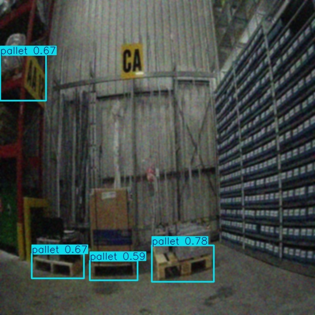
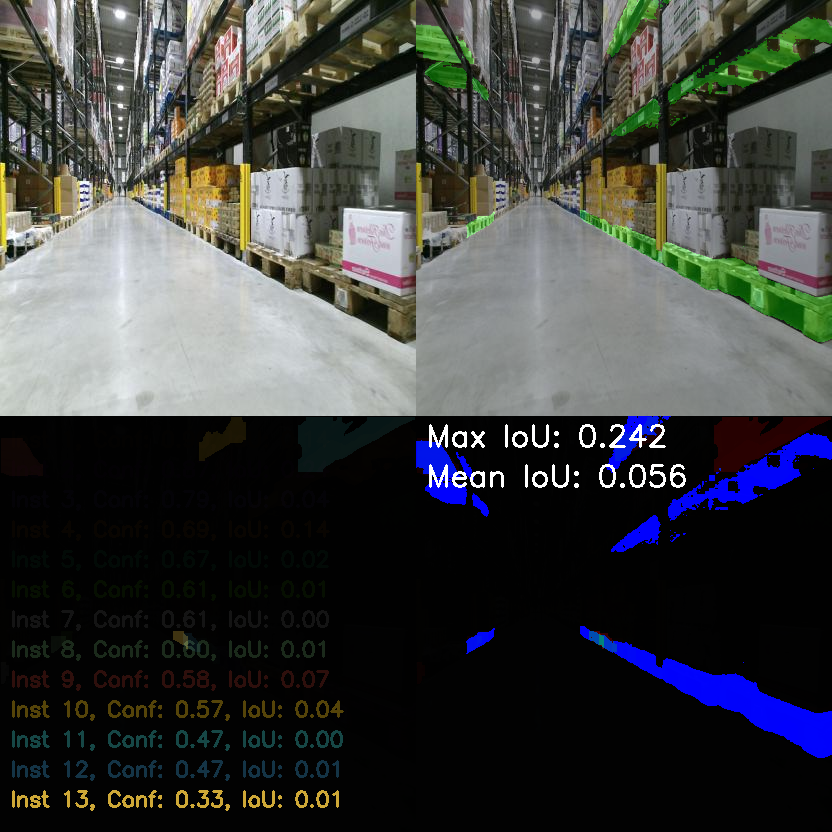
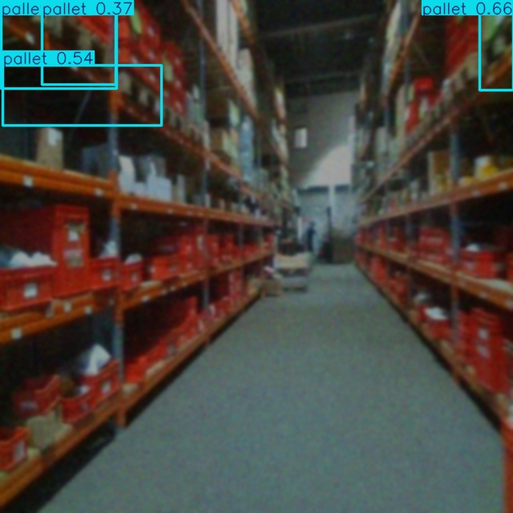
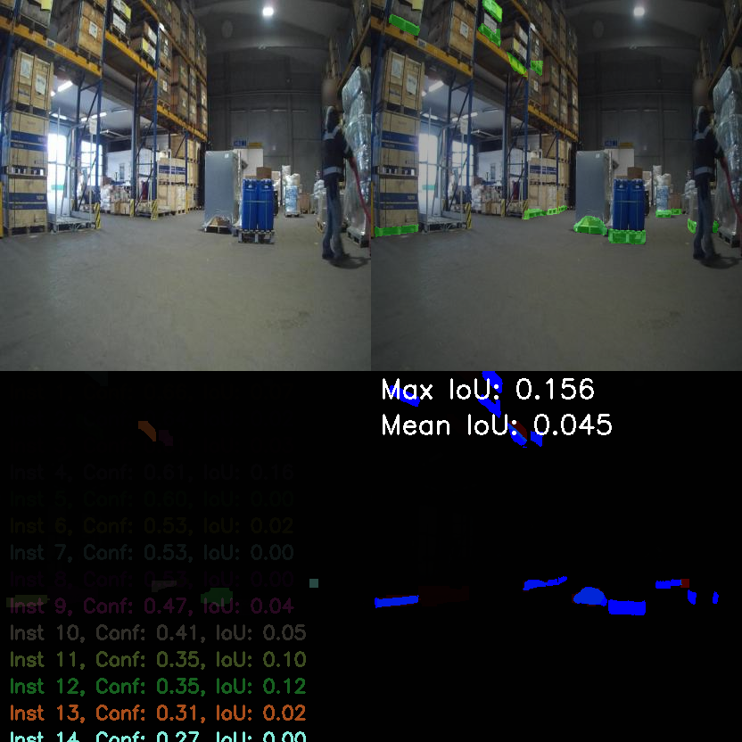

# Pallet Detection and Segmentation

This project implements an end-to-end solution for pallet detection and segmentation using YOLOv11 and SAM2 (Segment Anything Model 2). It includes tools for annotation, training, inference, and evaluation.




## Dataset

The complete dataset is available on Google Drive:
- [Detection Dataset](https://drive.google.com/drive/folders/xxx)
- [Segmentation Dataset](https://drive.google.com/drive/folders/xxx)

## Installation

1. Create and activate a virtual environment:
```bash
python -m venv venv_sam2
source venv_sam2/bin/activate  # Linux/Mac
# or
.\venv_sam2\Scripts\activate  # Windows
```

2. Install dependencies:
```bash
pip install -r requirements.txt
```

## Project Structure

### Detection

#### Annotation
- `pallet_annotator.py`: Uses Roboflow model for annotation and augmentation
  ```python
  python pallet_annotator.py --input_dir images/ --output_dir annotations/
  ```

#### Network
- `pallet_object_detection.py`: YOLOv11 fine-tuning implementation
  ```python
  python pallet_object_detection.py --data data.yaml --epochs 100
  ```

#### Inference and IOU
- `pallet_detection_inference.py`: Inference script with visualization
  ```python
  python pallet_detection_inference.py --weights best.pt --source images/
  ```

### Segmentation

#### Annotation
- `sam2_pallets.py`: Creates segments from bounding boxes using SAM2
  ```python
  python sam2_pallets.py --input_dir boxes/ --output_dir sam2_pallets/
  ```
- `det2_segformat.py`: Converts to YOLO segmentation format
  ```python
  python det2_segformat.py --input_dir sam2_pallets/ --output_dir yolo_segments/
  ```

#### Network
- `segment_network.py`: Segmentation model implementation
  ```python
  python segment_network.py --data segment_data.yaml --epochs 50
  ```

#### Inference and IOU
- `segmentation_inference.py`: Segmentation inference
- ` python segmentation_evaluation.py \
    --weights runs/segment/train/weights/best.pt \
    --test-images /home/uthira/pallet-detection/data/dataset-segment/test/images \
    --masks /home/uthira/pallet-detection/data/masks `: IoU calculation

### Utils

- `yolo_label_normalizer.py`: Normalizes YOLO format labels
  ```python
  python yolo_label_normalizer.py --input labels/ --output normalized_labels/
  ```
- `dataset_preparation.py`: Dataset preparation utilities
- `datasize.py`: Image size analysis
- `dataset_augment.py`: Data augmentation tools
- `dataset_download.py`: Dataset download utility

### Edge Deployment

- `optimize_yolo.py`: Model optimization for edge devices
  ```python
  python optimize_yolo.py --weights best.pt --output optimized.pt
  ```

## Results

### Detection Results
```

  - mAP@50: 0.59144
  - Precision: 0.64713
  - Recall: 0.51344
```



### Segmentation Results
```
Mean IoU Overall: 0.0400
Max IoU Overall: 0.9516
Min IoU Overall: 0.0000
Median IoU: 0.0131
`
``



## Requirements

```txt
torch>=2.0.0
ultralytics>=8.0.0
segment-anything-2==0.1.0
supervision>=0.3.0
opencv-python>=4.8.0
numpy>=1.24.0
```

## Citation

If you use this project in your research, please cite:
```bibtex
@software{pallet_detection_2024,
  author = {Uthiralakshmi Sivaraman},
  title = {Pallet Detection and Segmentation},
  year = {2024},
  publisher = {GitHub},
  url = {https://github.com/UthiraS/pallet_vision}
}
```


## Acknowledgments

- SAM2 by Meta AI Research
- YOLOv11
- Roboflow for the initial dataset annotation